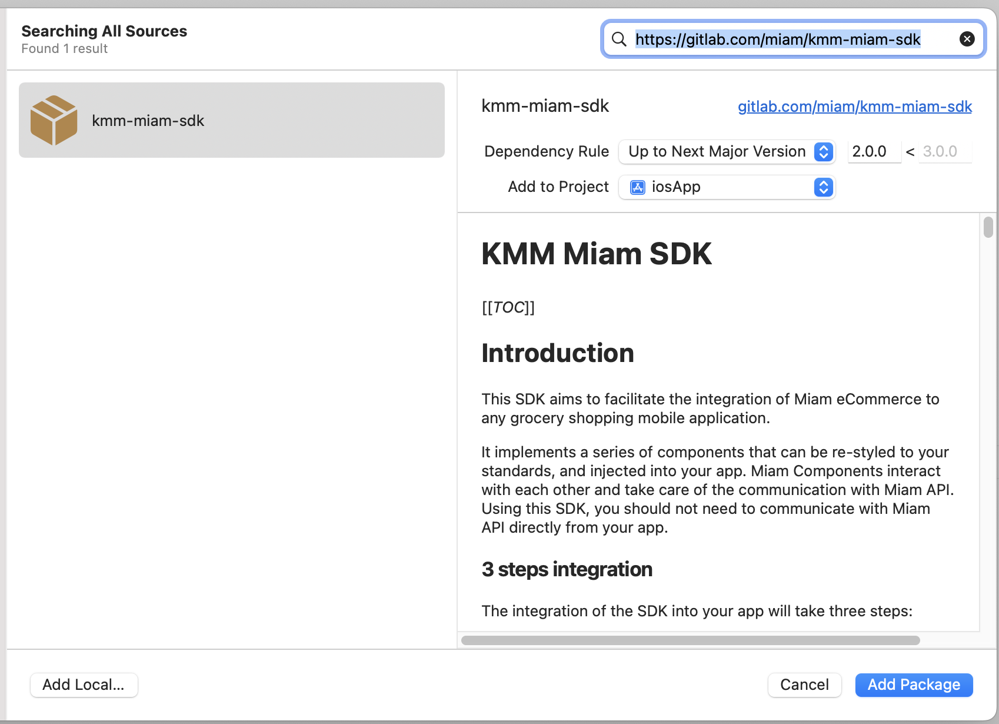

# Installation

You can use Mealz with Swift Package Manager & Cocoapods. Just add the following tags to your build dependencies

## Cocoapods

To integrate our packages into your Xcode project using CocoaPods, specify it in your Podfile:

```
pod 'MealzCoreRelease'
pod 'MealziOSSDKRelease'
```

## Swift package manager installation

To add Mealz as a dependency directly from Xcode.




Here are the links:

* MealzCoreRelease: https://github.com/miamtech/MealzCoreRelease
* MealziOSSDKRelease: https://github.com/miamtech/MealziOSSDKRelease