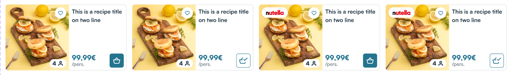
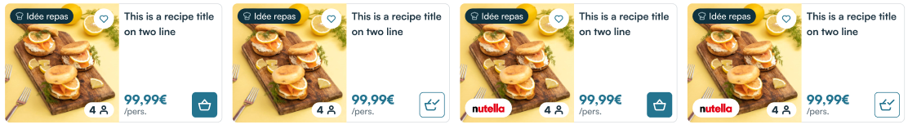
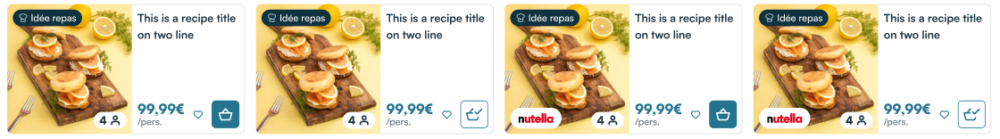

# Recipe card (SSR)

## Overview

The recipe card is the base of Mealz' whole experience. This card fetches and shows a recipe based on the items that are displayed around it (see [here](../about/features#how-the-recipes-displayed-in-the-cards-are-chosen) to see how the process of fetching the best recipe works).

The primary CTA on the card is the "Basket icon" button. When clicked, Mealz's drawer opens and shows the recipe's details. Clicking on the picture or title has the same effect.

Finally, by clicking on the heart icon the user can add the recipe to Mealz's favorite recipes list. This icon only appears if the user is connected.


> You need to have loaded the **token** to display recipes and the library needs a valid **store** to add products to the cart

- Parameters :

  - `store_id: string`:
  **_(Mandatory)_** Your store ID

  - `surrounding_products_ids: string[]`:
  **_(Mandatory if no `recipe_id` provided)_** an array of productIds around the place where you want to put the recipe card, the goal is to find a recipe matching the products
  _eg: if the recipe is surrounded by milk, we want to show a recipe that needs milk_

  - `recipe_id: string`:
  **_(Mandatory if no `surrounding_products_ids` provided)_** load a recipe from its id

  - `pricebook_key: string = 'DEFAULT'`:
  **_(Optional)_** the pricebook key is needed to retrieve the recipe price corresponding to the pricebook you are currently using. If your website doesn't have multiple pricebooks for the same store, this parameter is not needed.

  - `profiling: boolean = true`:
  **_(Optional)_** set to false if user refused profiling

  - `display_variant: number = 1`:
  **_(Optional)_** Select the variant for the display of the card. Default is 1, available values are 1, 2 and 3 (see below for examples)

  - `orientation: 'vertical' | 'horizontal' = 'vertical'`:
  **_(Optional)_** Select the orientation for the display of the card (see below for examples)

  - `current_products_ids: string[]`:
  **_(Optional)_** takes an array of product ids with a high priority on the suggestion. Does not have any effect if not paired with surrounding_products_ids

  - `serves: number`
  **_(Optional)_** Override the default number of guests set for the recipe

> Displaying a fixed recipe can be tempting if you want to have control on the content appearing on your website, but it also means that the users will always see the same recipes at the same places and may not stay interested, while our algorithm has some random elements to it that makes the content vary between sessions, giving the user more inspiration.

### Example :

:::warning
Do not forget the [mandatory HTTP headers](./pre-rendered-components#http-request-headers)
:::

A recipe contextualized with surrounding products **_(Recommended)_**:

```
GET http://MEALZ_SSR_API_URL/recipe-card?surrounding_products_ids=["214086","1254022"]&store_id=2817&pricebook_key=DEFAULT&serves=4&profiling=true&display_variant=3&orientation=horizontal
```

A fixed recipe:

```
GET http://MEALZ_SSR_API_URL/recipe-card?recipe_id=15123&store_id=2817&pricebook_key=DEFAULT&serves=4&profiling=true&display_variant=3&orientation=horizontal
```

### Display variants

**Variant 1 Vertical (default):**


**Variant 1 Horizontal:**


**Variant 2 Vertical:**


**Variant 2 Horizontal:**


**Variant 3 Vertical:**


**Variant 3 Horizontal:**



**The second and third variants are ideal for the cards you display in your shelves**, because of the badge in the upper-left corner (that you can easily replace by an image of your design that corresponds better to your website's design). **The third variant is better if your products have their "add to favorite" CTA next to the price**.

**The first variant is better for our catalog**, because displaying the badge on each card would be redundant, which is why we use this variant by default.
